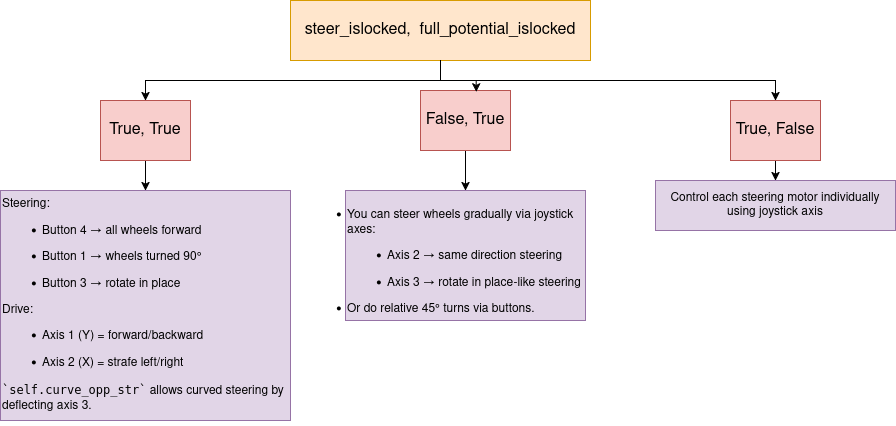

# This file helps in understanding the Full_Potential_Steering_auto.py script.

## Import
  - rospy
  - time
  - copy
  - queue
  - ros msgs like sensor_msg and std_msg
  - traversal (custom package)
  - add (from operators; equivalent to '+')

## Subscribers
  - `/joy`: Joystick input
  - `/enc_auto`: Encoder angles for steering feedback (`Float32MultiArray`)
  - `/motion`: Provides autonomous commands through linear and angular velocity msgs
  - `/rot`: Rotation mode integer

## Publishers
  - `motor_pwm`: Sends motor drive and steer PWM signals.
  - `state`: Publishes current mode (manual/autonomous)

## Attributes
  - `enc_callback()`: It reads steering encoder values and stores them in `self.enc_data` based on the correct wheel number and sign conventions. It gets this data from `msg.data` which is a list of 6 float values
  - `rotinplace_callback()`: It receives msg through `msg.data` which is a single integer that tells whether the wheel should rotate in place or move forward.
  - `autonomous_motion_callback()`: It firstly checks whether the motion is in autonomous mode. If true, it sets the desired linear and angular velocities and crab mode.
  - `joyCallback()`: It checks whether the motion is in manual mode. If true, it processes the joystick input to update the drive, steering and control mode states. Finally, it processes switching between autonomous and manual mode irrespective of previous mode.
  - `spin()`: It is the main publisher loop that runs at 10Hz. It keeps running till the ROS node is shutdown. It gives a pause while running to publish the pwm values to `motor_pwm`.
  - `main()`: It is the main loop that calls for steering, driving and autonomous control functions.
  - `autonomous_control()`: It checks whether it is in autonomous mode. If true, it decides the steering configurations by using values from `/rot` and `/motion` to set up commands.
  - `steering()`: It manages steering states like locked/unlocked, full potential, etc. and supports absolute and relative turning using encoder feedback. It rotates wheels for standard steering, crab or in-place modes.
  - `drive()`: It calculates forward and angular velocities from joystick input and publishes motor PWM commands to drive wheels.
  - `steer()`: It implements PID control to reach desired steering angles which is determined through encoder data.

  - `init_dir`: Sign configuration for each motor
  - `d_arr`: Velocity multipliers for each mode
  - `s_arr`: Steering PWM values
  - `max_steer_pwm`, `kp_steer`: Control gains
  - `vel_prev`, `omega_prev`: Queues for velocity smoothing

## Control Flow
1. Initialization:
   - `Drive` class is instantiated.
   - Registers the script as a ROS node named `drive_arc`.
   - Subscribed to the neccessary ROS topics.
   - Initialises variables like:
     1. `self.pwm_msg`: An `Int32MultiArray` to hold 8 motor PWM values (4 drive, 4 steering).
     2. `self.mode`: Drive/steering mode (0–4) that affects velocity scaling.
     3. `self.enc_data`: Stores encoder feedback for steering.
     4. `self.state`: Boolean flag to track manual or autonomous mode.
  
2. Joystick Input Processing:
  - `joyCallback()` is called when a joystick input is received.
  - It checks for triggering of button 6 and 7. Button 7 increases `self.mode` and button 6 decreases it. This can affect drive/steering sensitivity.
  - It checks for 3 states based on `steer_islocked` and `full_potential_islocked`.
    
    
    
  - To toggle it between the lock modes:
    Axis 4 pressed fully: toggles steering PWM
    Axis 5 pressed fully: toggles full-potential mode
  - Autonomous toggle:
    Button 0: toggles between autonomous and manual modes.
  - It updates and stores control flags like `drive_ctrl`, `steering_ctrl_locked`, `full_potential_pwm`,etc.

3. Main loop:
   - It coordinates control logic by calling functions like `steering()`, `drive()` and `autonomous_control`.
   - It publishes final motor commands to `motor_pwm`.
  
4. Autonomous steering mode:
  - This configures steering behaviour during autonomous mode using values from `/rot`.
  - It is only active when `self.state == True` (autonomous mode).
  - It decides steering configuations through:
    1. `rotin == 1`: In-place rotation
    2. `rotin == 2`: All wheels straight
    3. `rotin == 0`: Reset to no forced steering
  - It sets internal flags (`steering_ctrl_locked`) that are used by the steering() function.

5. Steering control:
  - It controls how the wheels are turned based on steering lock and full potential lock and joystick input/autonomous mode.
  - It decides the PWM value to send to the steering motors.
  - When both are locked:
  - `steering_ctrl_locked[0] == 1` :      | Forward Steering             | `[0, 0, 0, 0]`             
  - `steering_ctrl_locked[1] == 1` :      | Perpendicular Steering (90°) | `[90, 90, 90, 90]`         
  - `steering_ctrl_locked[2] == 1`  :     | Rotate-in-place              | `[55, -55, -55, 55]`       
  - `curve_opp_str != 0` (joystick axis) :| Curved drive steering        | Proportional to axis value 

  - When steering unlocked and full potential locked, it directly sets PWM for all 4 steering motors. It uses `max_steer_pwm` and `init_dir[]` to scale and assign signs.
  - When it is in full potential mode, it converts joystick input to PWM using mode-dependent `s_arr[mode]` multiplier.
  - Else case: when there is no valid input, all steering PWM values are set to 0. If steering is unlocked, it prompts the user to lock steering before driving.

6. Steering angle control:
   - It controls the rotation of the steering motors to reach the target angle based on encoder feedback.
   - Parameters:
     | Parameter        | Type    | Meaning                                                   |
     | ---------------- | --------| --------------------------------------------------------- |
     | `initial_angles` | list[4] | Starting angles of the 4 steering motors                  |
     | `final_angles`   | list[4] | Target angle offsets or absolute goals, depending on mode |
     | `mode`           | int     | `0 = relative`, `1 = absolute` steering control           |

   - A loop runs unitl the wheel angle is within `error_thresh` of the target angle or time `time_thresh` is reached.
   - In each iteration:
     1. It computes current encoder angle with the target
     2. It computes the angle error and multiplies it by `kp_steer` which is the PWM
     3. It caps the PWM between +-`max_steer_pwm` and writes it to self.pwm_msg.data[4:8]
     4. It finally publishes the PWM to `motor_pwm`

7. Driving control:
   - It computes and publishes PWM signals for the 4 drive motors based on joystick input or velocity commands from `/motion`.
   - It only runs when steering is completed, steering mode is locked and full potential mode is locked.
   - Mode 1:
       - FL and BL: Forward
       - FR and BR: Backward
       - This creates pure rotation about its centre
       - Velocity source: Manual: `self.drive_ctrl[1]`, Autonomous: `self.autonomous_omega`
    - Mode 2 (normal drive):
        - Combines linear velocity (forward/back) and angular velocity (left/right turning)
        - Left and right wheels receive `velocity +- omega`
        - Velocity source: Manual: `self.drive_ctrl[0]` and `self.drive_ctrl[1]`, Autonomous: `self.autonomous_vel` and `self.autonomous_omega`
    - PWM assignment: The velocities are multiplied by respective `init_dir[]` indices which also allows motor signs for correct motion.
    - It sets up a `MultiArrayLayout` for `motor_pwm`, labelled `write` of size 8 (4 drive+ 4 steer).

## Joystick mapping: 
| Function               | Button/Axis                      |
| ---------------------- | -------------------------------- |
| Increase Mode          | `modeupbtn (7)`                  |
| Decrease Mode          | `modednbtn (6)`                  |
| Forward Steering       | `forward_btn (4)`                |
| 90° Steering           | `parallel_btn (1)`               |
| Rotate In Place        | `rotinplace_btn (3)`             |
| Toggle Autonomous      | `autonomous_btn (0)`             |
| Unlock Steering PWM    | `steer_unlock_axis (4)`          |
| Unlock Full Potential  | `full_potential_unlock_axis (5)` |
| Drive Forward/Backward | `fb_axis (1)`                    |
| Drive Left/Right       | `lr_axis (2)`                    |

